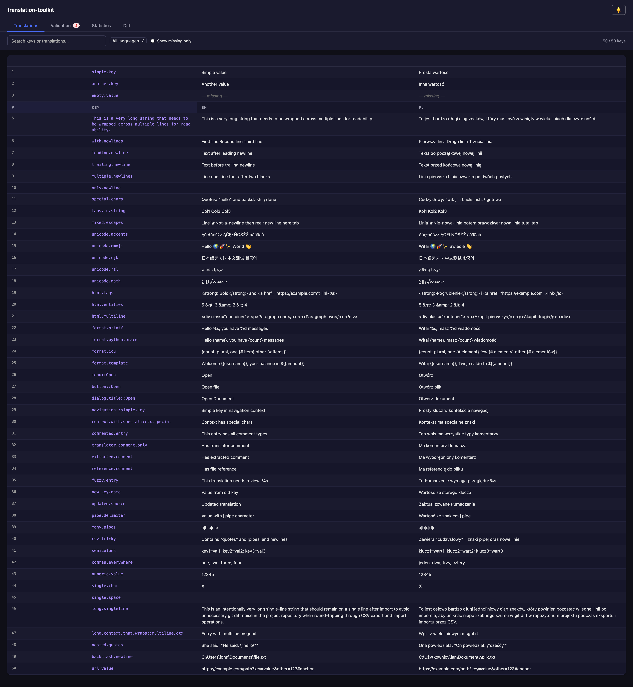
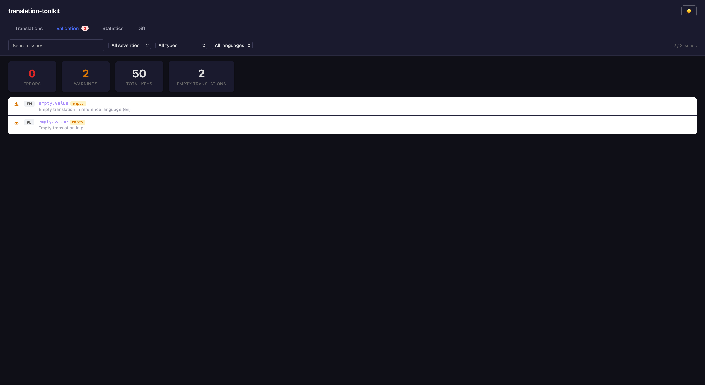
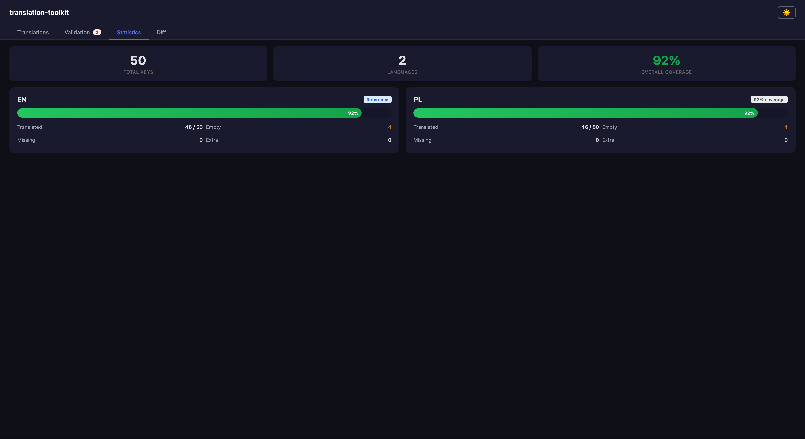
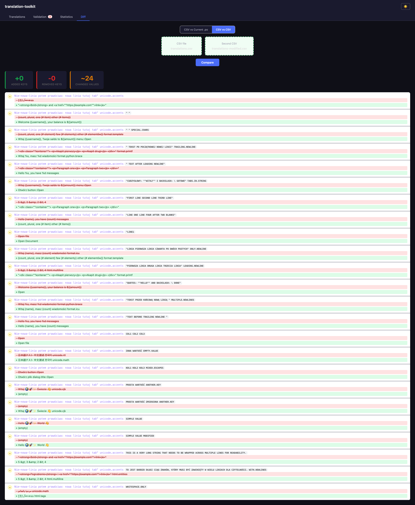
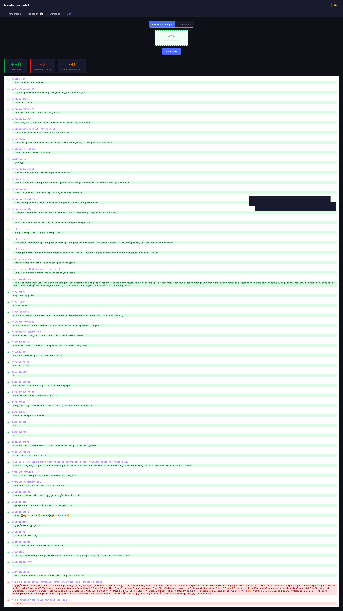

# translation-toolkit

[](https://www.npmjs.com/package/translation-toolkit)
[](LICENSE)
[](package.json)

A zero-dependency CLI tool to convert between [GNU gettext `.po`](https://www.gnu.org/software/gettext/manual/html_node/PO-Files.html) translation files and pipe-delimited CSV.

**Export** all your `.po` files into a single CSV that's easy to edit in any spreadsheet app (Excel, Google Sheets, LibreOffice). **Import** the CSV back to update or create `.po` files — including new languages.

## Table of Contents

- [Features](#features)
- [Screenshots](#screenshots)
- [Installation](#installation)
- [Quick Start](#quick-start)
- [Usage](#usage)
  - [Export](#export-po--csv)
  - [Import](#import-csv--po)
  - [Preview](#preview-browser)
  - [Validate](#validate-check-translations)
  - [Statistics](#statistics)
  - [Diff](#diff-compare-translations)
- [Auto-Discovery](#auto-discovery)
- [CSV Format](#csv-format)
- [CI/CD Integration](#cicd-integration)
- [Examples](#examples)
- [Typical Workflow](#typical-workflow)
- [Limitations](#limitations)
- [Contributing](#contributing)
- [License](#license)

## Features

- **Zero dependencies** — pure Node.js, nothing to install
- **Auto-discovery** — finds `.po` files in your project automatically
- **Round-trip safe** — export → import produces identical `.po` files
- **New languages** — add a column to CSV, import creates the `.po` file with correct `Plural-Forms`
- **Merge mode** — update only changed keys without removing existing ones
- **Custom delimiter** — use `|`, `;`, `\t`, or any character
- **Browser preview** — view all translations in a searchable table at `localhost`
- **Static export** — generate a standalone HTML preview file for GitHub Pages / S3 / email
- **Inline editing** — click any cell in the preview to edit translations directly in the browser
- **Plural forms** — full `msgid_plural` / `msgstr[N]` support: export as `key[N]` rows, import back, validate nplurals, preview with badge
- **Validation** — check for missing keys, empty translations, variable mismatches, fuzzy entries, plural form consistency
- **Statistics** — per-language coverage reports with progress bars
- **Diff** — compare two CSV files or a CSV against current `.po` files
- **Fuzzy detection & management** — `#, fuzzy` entries exported to `_status` column in CSV, highlighted in preview (yellow badge), counted in stats, warned in validate; on import, clear `_status` to unfuzzy, or keep `fuzzy` to preserve the flag
- **Dark mode** — toggle between light and dark themes in the browser preview
- **Interactive** — if multiple `.po` directories exist, prompts you to choose

## Screenshots

### Translations tab

Browse, search, and inline-edit all translations in a single table.



### Validation tab

Spot missing keys, empty translations, and variable mismatches at a glance.



### Statistics tab

Per-language coverage bars, key counts, and top missing keys.



### Diff tab — CSV vs CSV

Compare two CSV exports side by side — see added, removed, and changed keys.



### Diff tab — CSV vs .po

Compare a CSV against the current `.po` files to review pending changes.



## Installation

```bash
# Use directly without installing (recommended)
npx translation-toolkit export

# Or install globally
npm install -g translation-toolkit
```

## Quick Start

```bash
# Export all .po files to CSV
npx translation-toolkit export

# Edit translations.csv in your favorite spreadsheet editor...

# Import CSV back into .po files
npx translation-toolkit import translations.csv
```

## Usage

### Export (`.po` → CSV)

```bash
translation-toolkit export [options]
```

| Option                 | Description                                                       | Default            |
| ---------------------- | ----------------------------------------------------------------- | ------------------ |
| `-o, --output <file>`  | Output CSV file path (or directory for `--format json`/`i18next`) | `translations.csv` |
| `-d, --dir <path>`     | Translations directory                                            | auto-discover      |
| `-D, --delimiter <ch>` | Column delimiter                                                  | `\|`               |
| `-f, --format <fmt>`   | Output format: `csv`, `json`, or `i18next`                        | `csv`              |
| `--compat <ver>`       | i18next compatibility: `4` (CLDR) or `3` (legacy)                 | `4`                |
| `--no-status`          | Omit the `_status` column from the CSV                            | include status     |

**Example output** (`translations.csv`):

```text
key|_status|en|pl
mainMenu.send||Send packages|Wyślij przesyłki
mainMenu.help||Help|Pomoc
old.draft|fuzzy|Draft text|Wersja robocza
```

The `_status` column contains `fuzzy` for entries marked `#, fuzzy` in any language, and is empty otherwise. Use `--no-status` to omit it.

#### Plural forms in CSV

Plural entries are exported as separate `key[N]` rows — one per plural form:

```text
key|_status|en|pl
1 file[0]||%d file|%d plik
1 file[1]||%d files|%d pliki
1 file[2]|||%d plików
```

English has 2 forms (`[0]` singular, `[1]` plural). Polish has 3 forms. Empty cells are filled when a language has fewer forms. On import, `key[N]` rows are automatically grouped back into `msgid_plural` / `msgstr[N]` blocks.

#### JSON format (`--format json`)

Export to per-language flat JSON files instead of CSV:

```bash
translation-toolkit export --format json -o locales/ --dir src/i18n
```

Produces `en.json`, `pl.json`, etc.:

```json
{
  "simple.key": "Simple value",
  "menu::Save": "Save",
  "%d file": ["%d file", "%d files"]
}
```

- Singular entries → string values
- Plural entries → arrays of strings (one per form)
- `msgctxt` keys use `::` separator
- Nested JSON is **auto-flattened** on import: `{ "menu": { "save": "Save" } }` → `menu.save`

Import JSON back:

```bash
translation-toolkit import --format json locales/ --dir src/i18n
```

#### i18next format (`--format i18next`)

Export to i18next-compatible per-language JSON files:

```bash
translation-toolkit export --format i18next -o locales/ --dir src/i18n
```

Produces `en.json`, `pl.json`, etc. with CLDR plural suffixes (v4 default):

```json
{
  "simple.key": "Simple value",
  "%d file_one": "%d file",
  "%d file_other": "%d files"
}
```

For Polish (3 forms):

```json
{
  "%d file_one": "%d plik",
  "%d file_few": "%d pliki",
  "%d file_many": "%d plików"
}
```

Use `--compat 3` for legacy i18next v3 format:

```bash
translation-toolkit export --format i18next --compat 3 -o locales/
```

v3 output uses `_plural` / `_0`/`_1`/`_2` suffixes instead of CLDR categories.

Import i18next JSON back:

```bash
translation-toolkit import --format i18next locales/ --dir src/i18n
```

### Import (CSV → `.po`)

```bash
translation-toolkit import <file.csv> [options]
```

| Option                 | Description                                       | Default       |
| ---------------------- | ------------------------------------------------- | ------------- |
| `-m, --merge`          | Keep existing keys not present in CSV             | replace all   |
| `-n, --dry-run`        | Show what would change without writing files      | off           |
| `-d, --dir <path>`     | Translations directory                            | auto-discover |
| `-D, --delimiter <ch>` | Column delimiter                                  | `\|`          |
| `-f, --format <fmt>`   | Input format: `csv`, `json`, or `i18next`         | `csv`         |
| `--compat <ver>`       | i18next compatibility: `4` (CLDR) or `3` (legacy) | `4`           |

### Import modes

| Mode                  | Behavior                                                                       |
| --------------------- | ------------------------------------------------------------------------------ |
| **Replace** (default) | CSV is the source of truth. Keys not in CSV are removed from `.po`.            |
| **Merge** (`--merge`) | Existing `.po` keys are preserved. Only keys present in CSV are added/updated. |

### Fuzzy status on import

When the imported CSV contains a `_status` column (produced by `export`):

- **Empty `_status`** → the `#, fuzzy` flag is **removed** from the `.po` entry (unfuzzy)
- **`_status=fuzzy`** → the `#, fuzzy` flag is **preserved** (or added)
- Other comment flags like `c-format` are preserved on the `#,` line
- CSVs without `_status` leave fuzzy flags unchanged (backwards compatible)

### Adding a new language

Just add a column to the CSV:

```text
key|en|pl|cs
mainMenu.send|Send packages|Wyślij przesyłki|Odeslat balíky
```

On import, a new `cs-CZ.po` file is created automatically with the correct `Plural-Forms` header.

Supported locale mappings: `en`, `pl`, `cs`, `sk`, `de`, `fr`, `es`, `it`, `pt`, `nl`, `hu`, `ro`, `uk`, `ru`. Unknown codes produce `xx-XX.po` format.

### Preview (browser)

View all translations in an interactive table in your browser.

```bash
translation-toolkit preview [options]
```

| Option                | Description                                 | Default                          |
| --------------------- | ------------------------------------------- | -------------------------------- |
| `-d, --dir <path>`    | Translations directory                      | auto-discover                    |
| `-p, --port <number>` | HTTP server port                            | `3456`                           |
| `-w, --watch`         | Auto-reload on `.po` file changes           | off                              |
| `-s, --static`        | Generate a standalone HTML file (no server) | off                              |
| `-o, --output <path>` | Output file path (with `--static`)          | `translation-preview/index.html` |

If the requested port is in use, the server automatically tries the next port (up to 20 attempts).

Features of the preview page:

- **Tabs** — switch between Translations, Validation, Statistics, and Diff
- **Inline editing** — click any translation cell, edit it, and save back to `.po` files
- **Search** — filter keys and values in real time
- **Language filter** — show only a specific language column
- **Missing filter** — show only keys with missing translations
- **Counter** — shows how many keys match the current filter
- **Validation tab** — summary cards + filterable issue list with severity/type/language filters
- **Statistics tab** — per-language coverage bars, key counts, top missing keys
- **Diff tab** — upload CSV files to compare (CSV vs CSV or CSV vs current `.po`)
- **Dark mode** — toggle via the 🌙 button in the header (remembers your preference)
- **Save bar** — floating bar shows unsaved changes count with Save/Discard buttons
- **Watch mode** — `--watch` auto-reloads data when `.po` files change on disk (refresh browser to see updates)
- **Static export** — `--static` generates a self-contained HTML file with all data embedded (read-only, no server needed)


### Validate (check translations)

Check all `.po` files for common issues. Useful in CI pipelines (exits with code 1 on errors).

```bash
translation-toolkit validate [options]
```

| Option                 | Description                                                   | Default       |
| ---------------------- | ------------------------------------------------------------- | ------------- |
| `-d, --dir <path>`     | Translations directory                                        | auto-discover |
| `--json`               | Output results as JSON (for CI/tooling)                       |               |
| `--severity <level>`   | Filter: `error` or `warning` (default: all)                   | `warning`     |
| `--cross-format <fmt>` | Compare .po keys against exported format: `json` or `i18next` |               |
| `--format-dir <path>`  | Directory with exported JSON/i18next files                    |               |
| `--compat <ver>`       | i18next compatibility version (3 or 4)                        | `4`           |

Checks performed:

- **Missing keys** — key exists in reference language but not in target (error)
- **Extra keys** — key exists in target but not in reference language (warning)
- **Empty translations** — `msgstr` is empty (warning)
- **Variable mismatch** — `{{variables}}` differ between reference and target (error/warning)
- **Fuzzy entries** — `#, fuzzy` flag detected — translation needs review (warning)

The reference language is auto-detected as the one with the most keys (typically `en`).

**JSON output** (`--json`):

```json
{
  "errors": [
    { "type": "missing-key", "lang": "pl", "key": "bye", "message": "..." }
  ],
  "warnings": [
    { "type": "fuzzy-entry", "lang": "pl", "key": "hello", "message": "..." }
  ],
  "summary": {
    "refLang": "en",
    "languages": ["en", "pl"],
    "totalKeys": 50,
    "totalPluralKeys": 4,
    "totalFuzzyKeys": 3,
    "errorCount": 1,
    "warningCount": 1
  }
}
```

**Severity filtering** — use `--severity error` to show only errors (useful in CI when fuzzy warnings are expected):

```bash
translation-toolkit validate --severity error --json
```

**Cross-format validation** — verify that exported JSON or i18next files are in sync with `.po` source files. Reports missing keys, extra keys, value mismatches, and language coverage issues:

```bash
# Check JSON exports against .po files
translation-toolkit validate --dir src/i18n --cross-format json --format-dir locales/json/

# Check i18next exports against .po files
translation-toolkit validate --dir src/i18n --cross-format i18next --format-dir locales/

# i18next v3 compat mode
translation-toolkit validate --dir src/i18n --cross-format i18next --format-dir locales/ --compat 3
```

Cross-format issue types:

- **cross-format-missing-key** — key in `.po` but missing from export (error)
- **cross-format-extra-key** — key in export but missing from `.po` (warning)
- **cross-format-value-mismatch** — values differ between `.po` and export (warning)
- **cross-format-missing-lang** — `.po` language has no export file (error)
- **cross-format-extra-lang** — export file has no matching `.po` (warning)
- **cross-format-missing-plural / extra-plural / plural-mismatch** — plural form discrepancies

The reference language is auto-detected as the one with the most keys (typically `en`).


### Statistics

Show translation coverage statistics per language.

```bash
translation-toolkit stats [options]
```

| Option             | Description            | Default       |
| ------------------ | ---------------------- | ------------- |
| `-d, --dir <path>` | Translations directory | auto-discover |

Shows for each language:

- **Coverage %** with colored progress bar
- **Translated / total** key counts
- **Empty, missing, extra** key counts
- **Top missing keys** (first 5)
- **Overall coverage** across all languages


### Diff (compare translations)

Compare two CSV exports or a CSV against the current `.po` files.

```bash
# Compare two CSV files
translation-toolkit diff old.csv new.csv

# Compare CSV against current .po files
translation-toolkit diff translations.csv
```

| Option                 | Description                                | Default       |
| ---------------------- | ------------------------------------------ | ------------- |
| `-d, --dir <path>`     | Translations directory (CSV vs `.po` mode) | auto-discover |
| `-D, --delimiter <ch>` | Column delimiter                           | `\|`          |
| `--exit-zero`          | Always exit 0 even if differences found    | off           |

Detects:

- **Added keys** — in new but not in old
- **Removed keys** — in old but not in new
- **Changed values** — same key, different translation (per-language)

Exits with code 1 if differences found (useful for CI). Use `--exit-zero` for informational diffs in pipelines.


## Exit Codes

All commands exit with code 0 on success. Some commands use non-zero exit codes to signal specific conditions:

| Command    | Exit Code | Meaning                                           |
| ---------- | --------- | ------------------------------------------------- |
| `validate` | `1`       | Validation errors found                           |
| `diff`     | `1`       | Differences found (use `--exit-zero` to override) |
| Any        | `1`       | Fatal error (missing file, invalid input)         |

## Auto-Discovery

When `--dir` is not specified, the tool recursively searches the current working directory for folders containing `.po` files. It skips `node_modules`, `.git`, `dist`, `build`, and other common non-source directories.

- **1 folder found** → used automatically
- **Multiple folders** → interactive prompt:

  ```text
  Found .po files in multiple directories:

    [1] src/translations  (2 .po files)
    [2] locales/backend   (5 .po files)

  Pick a directory [1]:
  ```

- **No folders** → error with suggestion to use `--dir`

## CSV Format

- Default delimiter: `|` (pipe) — avoids conflicts with commas in translations
- First column is always `key` (the `msgid`)
- Second column is `_status` — contains `fuzzy` for entries with `#, fuzzy` flag in any language, empty otherwise (omit with `--no-status`)
- Language columns use short codes (`en`, `pl`, `cs`, ...)
- Fields containing the delimiter, `"`, or newlines are wrapped in double quotes
- Double quotes inside fields are escaped as `""`

## CI/CD Integration

Use the `--ci` flag for non-interactive mode. This prevents the tool from prompting when multiple `.po` directories are found — it auto-selects the first one instead.

```bash
# All commands support --ci
translation-toolkit validate --ci
translation-toolkit export --ci -o translations.csv
translation-toolkit import translations.csv --ci --dry-run
```

**Tip:** Always pass `--dir` explicitly in CI to avoid auto-discovery:

```bash
translation-toolkit validate --dir src/i18n
```

### GitHub Actions example

```yaml
name: Validate Translations
on: [push, pull_request]

jobs:
  translations:
    runs-on: ubuntu-latest
    steps:
      - uses: actions/checkout@v4
      - uses: actions/setup-node@v4
        with:
          node-version: 20
      - run: npm install -g translation-toolkit
      - run: translation-toolkit validate --dir src/i18n --ci
      - run: translation-toolkit stats --dir src/i18n --ci
```

**Tip:** Use `--json` for machine-readable validation output, and `--severity error` to ignore fuzzy warnings:

```bash
translation-toolkit validate --dir src/i18n --json --severity error
```

### Deploy static preview to GitHub Pages

Generate a standalone HTML preview and publish it as a build artifact or deploy to GitHub Pages:

```yaml
name: Translation Preview
on:
  push:
    branches: [main]

jobs:
  preview:
    runs-on: ubuntu-latest
    steps:
      - uses: actions/checkout@v4
      - uses: actions/setup-node@v4
        with:
          node-version: 20
      - run: npm install -g translation-toolkit
      - run: translation-toolkit preview --dir src/i18n --static -o docs/preview.html
      - uses: actions/upload-pages-artifact@v3
        with:
          path: docs/
```

The generated file is fully self-contained — all data, styles, and scripts are embedded in a single HTML file. No server or additional assets required.

## Examples

```bash
# Export with semicolon delimiter
translation-toolkit export -D ";" -o translations.csv

# Import with merge (don't delete missing keys)
translation-toolkit import translations.csv --merge

# Preview what import will change (without writing files)
translation-toolkit import translations.csv --dry-run

# Specify directory explicitly
translation-toolkit export --dir src/i18n
translation-toolkit import translations.csv --dir src/i18n

# Use with npx from any project
cd my-project
npx translation-toolkit export

# Preview translations in browser (with editing, stats, diff, dark mode)
translation-toolkit preview
translation-toolkit preview --port 8080
translation-toolkit preview --watch

# Generate standalone HTML preview (for GitHub Pages, S3, email)
translation-toolkit preview --static
translation-toolkit preview --static -o docs/preview.html

# Validate translations (CI-friendly)
translation-toolkit validate
translation-toolkit validate --dir src/i18n

# Cross-format validation — verify exports are in sync with .po
translation-toolkit validate --cross-format json --format-dir locales/json/
translation-toolkit validate --cross-format i18next --format-dir locales/ --dir src/i18n

# Translation statistics
translation-toolkit stats
translation-toolkit stats --dir src/i18n

# Diff: compare two CSV snapshots
translation-toolkit diff old.csv new.csv

# Diff: compare CSV against current .po files
translation-toolkit diff translations.csv --dir src/i18n
```

## Typical Workflow

```bash
# 1. Check current coverage
translation-toolkit stats

# 2. Export current translations
translation-toolkit export -o translations.csv

# 3. Send CSV to translators or edit in a spreadsheet
#    (or use the browser preview for quick edits)
translation-toolkit preview

# 4. Import the updated CSV
translation-toolkit import translations.csv

# 5. Compare changes
translation-toolkit diff translations.csv

# 6. Validate before committing
translation-toolkit validate

# 7. Verify git changes
git diff src/translations/
```

## Limitations

- Plural forms in the browser preview are **read-only** (not editable via inline editing; edit via CSV round-trip instead)

## Roadmap

| Phase | Feature                                                   | Status                 |
| ----- | --------------------------------------------------------- | ---------------------- |
| 1     | Core CLI (export, import, preview, validate, stats, diff) | ✅ Done                |
| 1.3   | DX improvements (dry-run, watch mode, port auto-detect)   | ✅ Done                |
| 1.4   | CI/CD mode (`--ci` flag, non-interactive, exit codes)     | ✅ Done                |
| 1.5   | Static preview export (`--static`) for GitHub Pages       | ✅ Done                |
| 2     | Plural forms (`msgid_plural` / `msgstr[N]`)               | ✅ Done                |
| 3     | Additional formats: JSON, XLIFF, Android XML              | 🔄 JSON + i18next done |
| 4     | Custom validation rules                                   | Planned                |

## Contributing

Contributions are welcome! Please:

1. Fork the repository
2. Create your feature branch (`git checkout -b feature/amazing-feature`)
3. Commit your changes (`git commit -m 'Add amazing feature'`)
4. Push to the branch (`git push origin feature/amazing-feature`)
5. Open a Pull Request

For bugs or feature requests, please [open an issue](https://github.com/qubuss/translation-toolkit/issues).

## License

MIT — see [LICENSE](LICENSE) for details.
